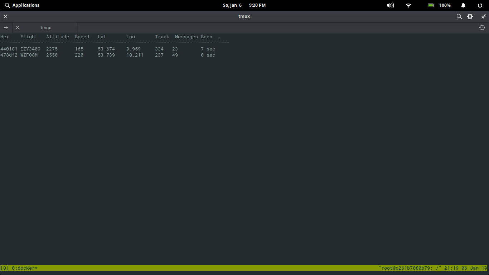

# Dockerized ADS-B Receiver

## Motivation

I just moved to an area where it is possible to spot planes and as you may not know, I'm pretty into planes. Well, I'm really fascinated by (of course) the technical side of such an awesome machine.

Anyways, I just learned that all modern airplanes have a system on board, called [ADS-B](https://en.wikipedia.org/wiki/Automatic_dependent_surveillance_%E2%80%93_broadcast) - the _Automatic dependent surveillance—broadcast_. In fact, the aircraft determines its position via GPS and broadcasts that data continuously. This data is not just limited to the position of the plane, no, it transmits also the current altitude, the speed and the flight number. Generally speaking the system is for security purposes of course. Other airplanes receives this data and pilots can see this information in their in-cockpit flight displays.

Security is cool for sure, but another cool aspect: You can receive this data as well:



## Usage

Receiving the signals is possible by using a DVB-T / SDR dongle and a little antenna. Personally, I can recommend the [NooElec](https://www.amazon.de/NooElec-NESDR-Mini-USB-Empf%C3%A4nger-Set-Female-SMA-Adapter/dp/B00VZ1AWQA/ref=sr_1_6?ie=UTF8&qid=1546804572&sr=8-6&keywords=nooelec). It is a good starter set as it ships with a decent antenna.

So enough words. This repository contains only a containerized version of the awesome [dump1090](https://github.com/antirez/dump1090) tool.

To give it a testflight, just:

1. Plug the dongle into a free USB port
2. Start the container via:

```sh
docker run -i -t --rm --privileged -v /dev/bus/usb:/dev/bus/usb -p 8080:8080 akoenig/adsb-receiver
```

You should see the airplanes around you (give it a few minutes). You can also check the map on [flightradar24.com](https://www.flightradar24.com/) to see if a plane is approaching your area (you should see it in your shell then as well).
